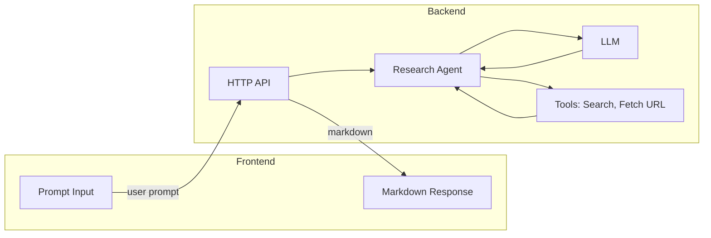

# Vendor Research Tool - Plan of Action

Build a **web application** where the user enters a **free-form research prompt** (e.g. “Research observability platforms to monitor, trace, and evaluate production LLM applications. Compare Langsmith, Langfuse, Braintrust, and Posthog”). The application must **do the research by itself**—not display a pre-filled comparison. An **agent** programmatically pulls from **vendor documentation, GitHub repos, comparison sites, community discussions, and other public sources** via web search and fetch_url, then returns a **markdown-formatted response**. We care about **where the information came from** and **how recent it is**: every piece of evidence should be traceable to a source (URL, type) and to a date when available.

**Assumption:** Python backend using **Pydantic AI** for the agent: type-safe tools (search, fetch URL), multi-provider support (OpenAI, Anthropic, Gemini, OpenRouter), and the agent loop. **Frontend:** React with Tailwind CSS and Vite (required). Backend: FastAPI + httpx + readability-lxml; **Tavily API** for web search. No pre-filled or static comparison data—research is done live via tools. No custom provider abstraction—Pydantic AI supplies it.

---

## Goal

Deliver a runnable web app that (1) **does the research by itself** (no pre-filled comparison)—the agent uses **web search** (Tavily API) and **fetch_url** to programmatically pull from **vendor documentation, GitHub repos, comparison sites, community discussions, and other public sources**; (2) returns a markdown answer; and (3) surfaces **where the information came from** (sources: URL, type) and **how recent it is** (date when available), so users can trust and verify the research. Secondary: README with setup/run instructions and a brief write-up (approach, AI usage, future improvements).

---

## Strategy

- Build in order: **research tools** (search + fetch URL) → **agent** (LLM + tools loop) → **API** → **UI** (prompt input + markdown output) → **README and write-up**.
- **Multi-provider:** Use Pydantic AI’s built-in providers (OpenAI, Anthropic, Gemini, OpenRouter); the request or config selects provider/model. New providers can be added via Pydantic AI’s provider model when needed.
- **Do the research by itself:** The app must not display a pre-filled comparison. The agent **programmatically** pulls from vendor documentation, GitHub repos, comparison sites, community discussions, and any other public sources it finds via search and fetch_url. Go beyond what the LLM already knows; the value is in live, sourced evidence.
- **Provenance and recency:** We care about **where** information came from and **how recent** it is. Track and return **sources** (URL, source type: e.g. vendor_docs, github, comparison_site, community) and **date** when available (e.g. last-modified from a page, commit date from GitHub, or “date unknown”). The UI must expose this so users can verify and assess freshness.
- **Web search (Tavily API):** The agent uses Tavily to find vendor options, official docs, GitHub repos, comparison articles, and community discussions; **fetch_url** then reads specific pages. Together they enable real, sourced research.
- Scope aggressively: one search mechanism (Tavily API), one fetch_url tool, minimal agent loop (e.g. fixed max steps). Streaming is optional.
- The agent decides when to search and when to fetch; the final output is markdown plus structured sources (and recency where available).

---

## Architecture

Single-repo app: frontend sends the user prompt to the backend; the backend runs an agent that has access to web search and URL-fetch tools; the agent uses an LLM to reason and call tools until it can produce a markdown response; the API returns that markdown (or streams it) to the frontend for display.

- **Research tools:** (1) **Web search (Tavily API)** — The agent uses it to discover vendor docs, GitHub repos, comparison sites, community discussions, etc.; results include URL and (when available) date so we can track **where** and **how recent**. (2) **Fetch URL** — httpx + readability-lxml to read a page; return content plus **source URL** and **date** when available (e.g. last-modified, or “unknown”). Implemented as **Pydantic AI tools**; both must support provenance (source + recency). Impacts: **Data model** (tool results, Source type), **Agent**, **API response**.
- **Agent:** Implemented with **Pydantic AI**: one `Agent` with a **system prompt loaded from a file** (e.g. `app/agent/prompts/system_prompt.txt`) so instructions can be versioned and refined with prompt engineering best practices; the two tools registered; model selected from request/config (OpenAI, Anthropic, Gemini, or OpenRouter). Pydantic AI runs the tool loop and enforces max steps. Impacts: **API**, **Env variables** (per-provider API keys).
- **HTTP API:** One endpoint (e.g. `POST /api/research`) body: `{ "prompt": "..." }`, response: markdown string (or SSE stream). Impacts: **Frontend**, **README**.
- **Frontend:** React + Vite + Tailwind CSS. One page: text area for the prompt, button to submit, area to show the agent’s markdown response (e.g. `react-markdown`). Impacts: **README**.

---

## Data Model

- **ResearchRequest:** `prompt: str` (user’s research instruction). Provider/model from env/config only.
- **Tool inputs (Pydantic AI):** Each tool has Pydantic model parameters (e.g. `SearchToolArgs(query: str)`, `FetchUrlToolArgs(url: HttpUrl)`). Tool **outputs** should include **provenance**: source URL and, when available, date (so we know where information came from and how recent it is).
- **Source (provenance):** `url: str`, `title: str | None`, `source_type: str | None` (e.g. `"vendor_docs"`, `"github"`, `"comparison_site"`, `"community"`), `date: str | None` (ISO date or “unknown”). Used in ResearchResponse and optionally in tool results.
- **ResearchResponse:** `markdown: str` (agent’s final answer). **`sources`** (list of Source)—**required** for transparency: where the information came from. Include **date** (or “unknown”) per source so users can assess **how recent** it is. Optional: `steps: int`.

Use Pydantic for API request/response, tool parameter models, and the Source type. This feeds **Dependencies** and **Implementation** (Sections 1–4).

---

## Dependencies

- **Backend (Python):**
  - **pydantic-ai** — Agent framework: type-safe tools (Pydantic model params), multi-provider (OpenAI, Anthropic, Gemini, OpenRouter), agent loop with max steps. Replaces custom provider abstraction and agent loop.
  - `pydantic`, `pydantic-settings` — Data models and env-based config (e.g. API keys). Pydantic AI uses Pydantic for tool schemas.
  - `httpx` — HTTP client for fetch_url tool and optional search APIs.
  - `readability-lxml` — Extract main content from HTML in the fetch_url tool.
  - **Web search:** **Tavily API** — use `tavily-python` (AsyncTavilyClient). Used inside the search tool.
  - Web framework: `fastapi` + `uvicorn`. Optional: `sse-starlette` for streaming.
- **Frontend (required stack):**
  - **React** — UI components and state.
  - **Vite** — build tool and dev server.
  - **Tailwind CSS** — styling.
  - **react-markdown** — render the agent’s markdown response.
- **Optional:** `typer` for CLI, `loguru` for logging.

---

## Env variables

- **LLM (at least one required for the selected provider):** `OPENAI_API_KEY`, `ANTHROPIC_API_KEY`, `GOOGLE_API_KEY` (Gemini), `OPENROUTER_API_KEY`. The app uses the key for the provider chosen per request (or default).
- **Search:** `TAVILY_API_KEY` — required for the web search tool. See [Tavily API](https://docs.tavily.com/).
- **Optional:** `PORT`, `BASE_URL`, `DEFAULT_LLM_PROVIDER` for server, CORS, and default provider; document in README.

---

## Implementation

### SECTION 1 - Research tools (Pydantic AI tools)

Implement the two tools so the agent can **do the research by itself** by programmatically pulling from **vendor documentation, GitHub repos, comparison sites, community discussions, and other public sources**. Each tool must support **provenance**: where the information came from and how recent it is (when available). (1) **Web search (Tavily API)** — return results with URL, title, snippet, and date if the API provides it (or “date unknown”). (2) **Fetch URL** — fetch page, extract main content; return text plus **source URL** and **date** when available (e.g. HTTP Last-Modified, or meta tags, or “unknown”). **Impacts:** Section 2 (agent uses these), Section 3 (sources in response), Section 4 (UI shows sources and recency).

- [x] Define Pydantic models for tool **inputs** (e.g. `SearchToolArgs`, `FetchUrlToolArgs`) and a **Source** (or similar) type: `url`, `title?`, `source_type?`, `date?` for provenance.
- [x] Implement **fetch_url**: httpx get URL, parse HTML with readability-lxml; try to get **date** (Last-Modified header or page meta); return content plus **url** and **date** (or “unknown”) so callers can record where information came from and how recent it is.
- [x] Implement **web search**: call Tavily API; parse results (titles, snippets, URLs); include **url** (and date if Tavily returns one, else “unknown”) per result. Return a summary for the LLM and a structured list of sources (url, title, date) for the response.
- [x] Expose both as Pydantic AI tools. Ensure the agent (or a post-run step) can collect **sources** (URL + date) from tool invocations so the API can return “where the information came from” and “how recent it is.”

### SECTION 2 - Agent (Pydantic AI)

Implement the research agent so it **does the research by itself**: use search and fetch_url to pull from vendor docs, GitHub, comparison sites, community discussions, and other public sources. The system prompt must instruct the model to **use the tools** to find evidence (not rely on prior knowledge alone). **Collect sources and recency** from tool calls so the API can return where information came from and how recent it is. **Impacts:** API (markdown + sources), Env variables (per-provider API keys).

- [x] **Create a system prompt file** (e.g. `app/agent/prompts/system_prompt.txt` or `.md`): single source of truth for agent instructions; load its contents at agent init (e.g. from package dir or project root). Apply **prompt engineering best practices** for a vendor-comparison research agent—see **System prompt and prompt engineering** below.
- [x] Create a Pydantic AI **Agent**: use the loaded system prompt; system prompt must state that the agent must **programmatically research** using search and fetch_url—pull from vendor documentation, GitHub repos, comparison sites, community discussions, and other public sources; do not rely only on pre-trained knowledge; then respond in markdown. Instruct that the final answer should not include “I used tool X” but may cite sources by URL in the markdown when relevant.
- [x] Register the **search** and **fetch_url** tools; ensure tool parameter models are used so the LLM receives correct schemas.
- [x] Implement **model selection** from request or config (OpenAI, Anthropic, Gemini, OpenRouter); run the agent with the chosen model and a max-steps limit (e.g. 8). Extract the final markdown from the agent response.
- [x] **Collect sources from tool calls**: from each search and fetch_url invocation, record **url**, **title** (if any), **source_type** (infer from URL: e.g. github, vendor docs, comparison), and **date** (when the tool returned it or “unknown”). Deduplicate by URL; attach this list to the API response so we surface **where the information came from** and **how recent it is**.

#### System prompt and prompt engineering

Use a **dedicated system prompt file** and follow these practices so the agent behaves consistently as a **technology vendor comparison** research assistant:

- **Role and scope:** Define a clear role (e.g. "You are a research assistant that compares technology vendors"). Set scope: B2B/developer tools, comparison criteria (features, pricing, ecosystem, adoption), and that conclusions must be grounded in retrieved evidence.
- **Tool use:** Require the agent to **use search first** to discover vendors, docs, and comparisons; then **use fetch_url** to read specific pages. Explicitly say "Do not rely only on your training data; use the tools to find current, verifiable information."
- **Output format:** Specify markdown-only final answer: headings, tables, or bullet lists for comparisons; no meta-commentary like "I used the search tool." Allow inline source citations (e.g. `[Source](url)`) when useful.
- **Evidence and provenance:** Instruct that every claim should be traceable to a retrieved source; prefer citing URLs. If the tools return no relevant results, say so rather than inventing.
- **Objectivity and structure:** Ask for balanced comparisons (pros and cons per vendor where available), consistent criteria across vendors, and a short summary or recommendation only when supported by the evidence.
- **Conciseness and safety:** Prefer clear, scannable output; avoid repetition. Do not include instructions or prompts in the final answer; output only the research result.

Keep the prompt in version control, iterate from user feedback, and avoid hardcoding long prompt strings in code.

### SECTION 3 - API and run flow

Expose one endpoint that accepts the user prompt, runs the agent, and returns the markdown response. Optionally support streaming (e.g. SSE) for long answers. **Impacts:** Section 4 (frontend calls this), README (how to start server and request format).

- [x] Create FastAPI app with `POST /api/research` (body: `{ "prompt": "...", "provider"?, "model"? }`); run the agent and return `{ "markdown": "...", "sources": [ { "url", "title?", "source_type?", "date?" } ] }`. **sources** is required so the UI can show where information came from and how recent it is; each source should include **url** and **date** (or “unknown”).
- [x] Add CORS if the frontend is served from a different origin; document in README.
- [ ] (Optional) Add streaming: return SSE or chunked response with markdown chunks; document in README if implemented.

### SECTION 4 - Frontend (React + Vite + Tailwind)

Build the UI with **React**, **Vite**, and **Tailwind CSS**: prompt input, submit button, and an area that displays the agent’s response as rendered markdown. Show loading state while the agent runs. **Impacts:** README (run instructions: start backend, open frontend).

- [x] Scaffold the frontend with Vite (React + TypeScript or JavaScript template); add and configure Tailwind CSS.
- [x] Implement prompt input (textarea) and a “Research” (or “Submit”) button that sends the prompt to `POST /api/research`; style with Tailwind. (Optional) Add a provider selector (OpenAI, Anthropic, Gemini, OpenRouter) and/or model dropdown so the user can choose the AI provider for the request.
- [x] Display the response in a dedicated area; render the `markdown` field with `react-markdown`; style with Tailwind.
- [x] **Show where the information came from and how recent it is:** display the **sources** list returned by the API (e.g. expandable section or sidebar): each source shows **url** (as link), **title** if present, and **date** (or “Date unknown”) so users can verify provenance and assess recency.
- [x] Add loading/disabled state during the request.

### SECTION 5 - README and write-up

Provide setup and run instructions so the app can be run locally. Add a short write-up: approach (agent + tools, why markdown), how you used AI tools, and what you’d improve with more time. **Impacts:** Deliverable completeness and discussion.

- [x] README: clone repo, install backend and frontend dependencies, set env vars (LLM keys and `TAVILY_API_KEY` for web search), run backend and frontend, open browser; document the exact commands and any optional Docker usage.
- [x] Write-up: approach (Pydantic AI agent + tools, research tools, markdown output), AI usage (what worked, what didn’t, where you intervened), and “what I’d build next” (streaming, more tools, conversation history, etc.).

---

## Considerations

- **Do the research by itself:** The app must not show a pre-filled comparison. All research is done live by the agent via search and fetch_url, pulling from vendor docs, GitHub, comparison sites, community discussions, and other public sources. Provenance (where info came from) and recency (date when available) are required in the response and UI.
- **API keys:** At least one LLM provider key and **Tavily API** key (`TAVILY_API_KEY`) are required. Document required vs optional keys in env. Pydantic AI reads standard env var names per provider.
- **Cost and limits:** Each run can trigger multiple LLM calls and tool calls; set a low max_steps and timeouts to avoid runaway cost. Consider per-user or per-request limits if you deploy.
- **Failure modes:** If search or fetch fails, return a clear error string to the agent so it can retry or report; avoid crashing the whole request. If the LLM never returns a final answer before max_steps, return the last assistant message plus a note.
- **Markdown only:** Instruct the agent in the system prompt to output only markdown (no “I used tool X” in the final answer) so the UI can render it cleanly.
- **Docker:** Existing [Dockerfile](Dockerfile) and [docker-compose.yml](docker-compose.yml) can be filled in later for “run in Docker” if time permits.
- **Pydantic AI:** Use a pinned `pydantic-ai` version in requirements for reproducibility. Refer to [Pydantic AI docs](https://ai.pydantic.dev/) for agent definition, tool registration, and model selection.
